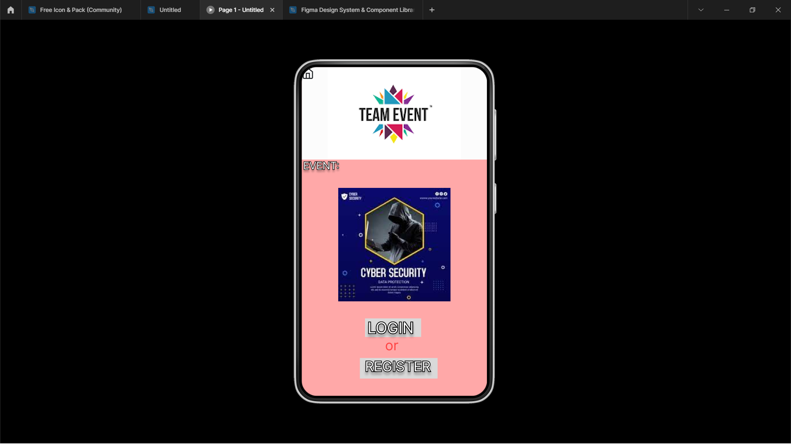
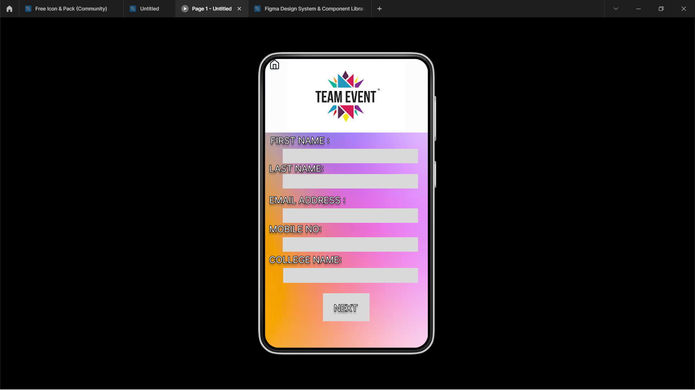
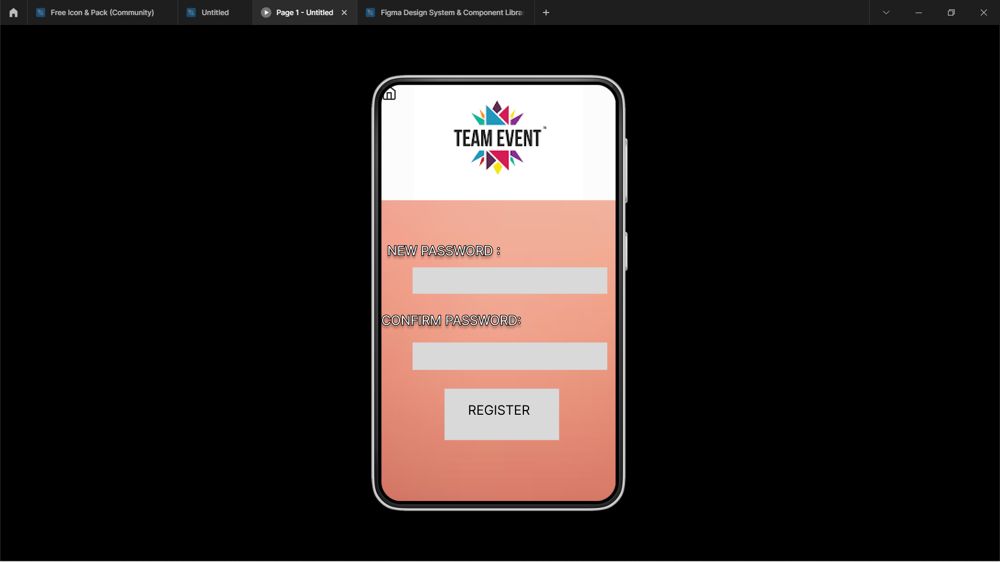
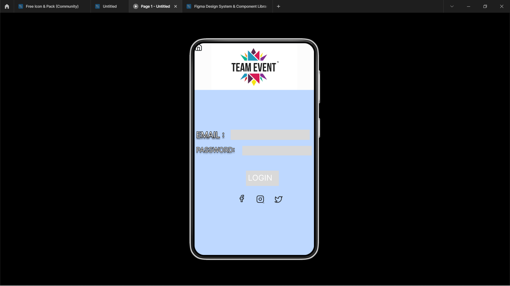
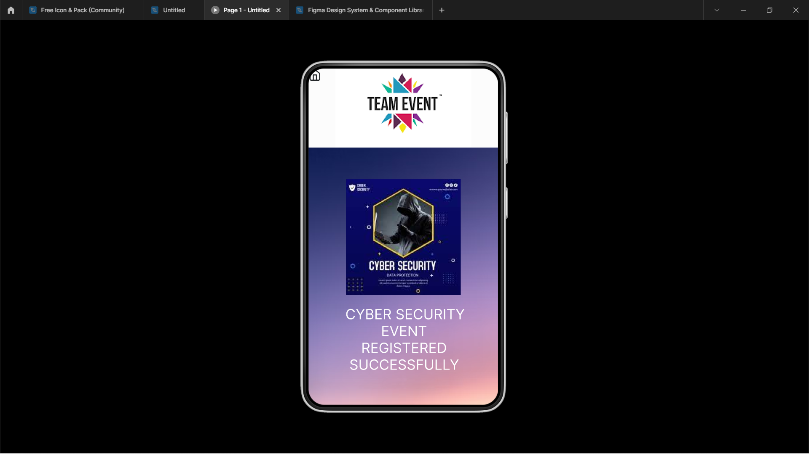

# Event Registration Web Application

## AIM:
To design, develop and deploy a web application for event registration.

## DESIGN STEPS:

### Step 1:
Start making the UI design for web page.

### Step 2:
Start making the UI design for web page.

### Step 3:
Start making the UI design for web page.

## OUTPUT:

## Result:
Hence the UX design for the Event Registration webpage is done.

